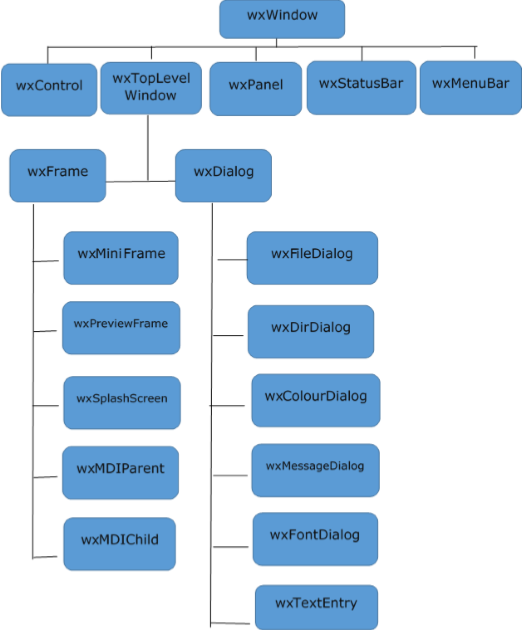

# Chapter 01

Here you will create your first silly app that does nothing special, but introduces you to `wx.App`, `wx.Frame` and `wx.Panel` which are three important components to creating apps in wxPython.

Reference: https://www.tutorialspoint.com/wxpython/wxpython_major_classes.htm

## Understanding the hierarchy

