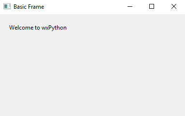

# wxtutorials

## What is this?

This is a repository of wxPython tutorials. It is to accompany the lecture videos I've uploaded (pending) to YouTube.

- Link to be added upon video uploads

## Requirements

- wxPython version 4.0.2+

- Python 3.6+

- Some python experience (strongly recommended)

- Git (recommended, you're on Github)

- Bash-like terminal (recommended)

## Who is this for?

People who 

- don't want to learn PyQT and don't want to pay for the liscensing.

- need a simple GUI platform

Better looking platforms exist, but wxPython can be quick and easy to develop applications in.

## Set up

All code was written on a Ubuntu machine, but is compatible with *most* Windows machines. If you are developing natively on Windows, be sure to have a Unix like terminal available like Git-bash or Ubuntu terminal.

### Terminal stuff

- [Git Bash](https://git-scm.com/downloads)

- [Install the Linux Subsystem on Windows 10 | Microsoft Docs](https://docs.microsoft.com/en-us/windows/wsl/install-win10)

You will need Git to clone this project directory

    git clone https://github.com/Johnnyboycurtis/wxtutorials.git

### Python stuff

All code was developed using Python 3.6+ and wxPython 4.0.2. If you are still using Python 2, please consider migrating to Python 3 as support is for version 2 is limited; see [count down](https://pythonclock.org). 

#### Flavor of Python

There are many flavors of Python. I recommend using Anaconda's [Miniconda](https://conda.io/miniconda.html); not the full blown Anaconda download.

#### Environments

For your sanity's sake, I *highly* recommend using `virtualenv` or `conda`'s  environments. I use miniconda; you can create a new environment with whatever version of Python you'd like with a simple command

    conda create -n myenv python=3.6

and activate it on your system's (bash) terminal with

    source activate myenv

Reference: [Managing environments — Conda documentation](https://conda.io/docs/user-guide/tasks/manage-environments.html)

#### Installing packages

To install `wxPython` and all other necessary packages, run

    conda install -c anaconda wxpython
    conda install matplotlib numpy ipython

## Still confused?

Here are some  helpful resources, but beware, they may be outdated

- http://zetcode.com/wxpython/

- https://wiki.wxpython.org/How%20to%20Learn%20wxPython

- https://www.tutorialspoint.com/wxpython/

### How do I become an expert?

Practice, my friend. [Complexity and the Ten-Thousand-Hour Rule](https://www.newyorker.com/news/sporting-scene/complexity-and-the-ten-thousand-hour-rule)